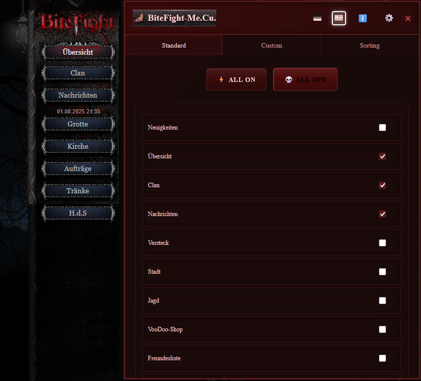
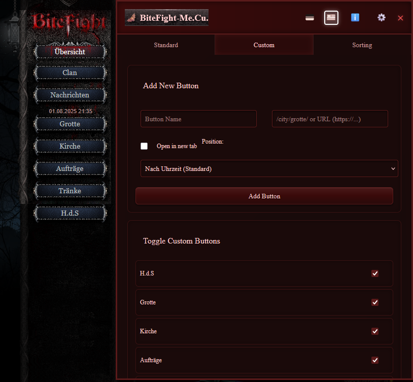
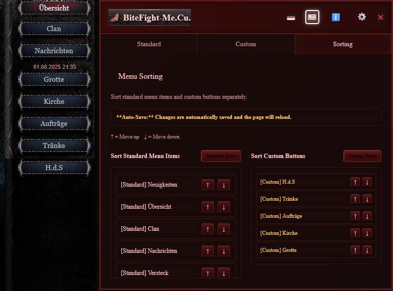
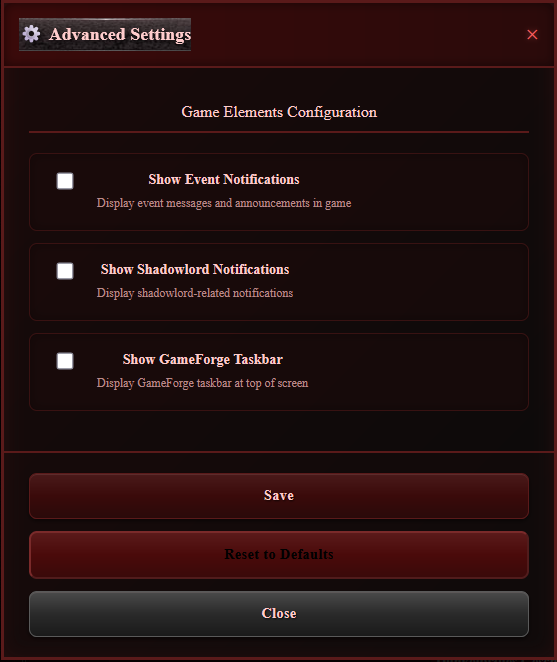
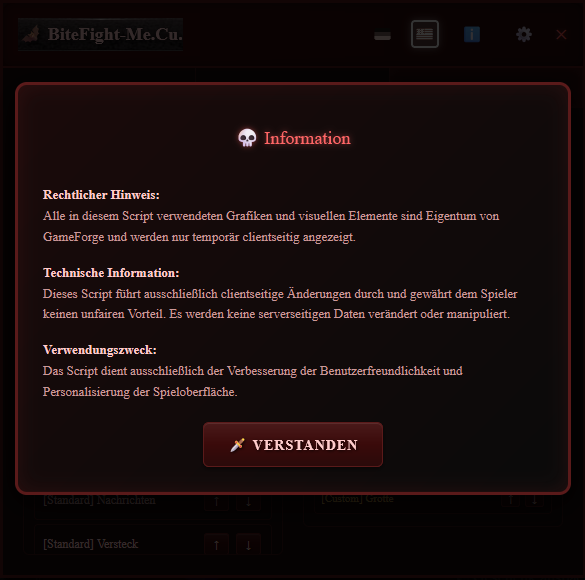

# 🦇 BiteFight Menu Customizer

Ein mächtiges Browser-Addon für BiteFight.gameforge.com, das das Spielmenü mit einem düsteren, vampirischen Design vollständig anpassbar macht.

## ✨ Features

### 🎨 **Düsteres, furchteinflößendes Design**
- Vampirisches BiteFight-Theme mit dunklen Rottönen (#1a0a0a, #5a1a1a)
- Bedrohliche Hover-Effekte und Schatten
- Konsistente CSS-Klassen (.bitefight-btn, .bitefight-container, etc.)
- Furchteinflößende Textfarben mit Glow-Effekten

### 🌫️ **Selektiver Hintergrund-Blur**
- Nur der Spielinhalt verschwimmt bei geöffneter UI
- Perfekte Fokussierung auf die Menü-Einstellungen
- Smooth Übergangseffekte (0.3s ease)

### 🎯 **Menü bleibt scharf sichtbar**
- `#menu` Container komplett vom Blur ausgenommen
- Live-Vorschau aller Änderungen am Menü
- Interaktive Custom Buttons bleiben voll funktionsfähig
- Zeit-Element (#time) ebenfalls scharf dargestellt

### 🚫 **Komplette Scroll-Sperrung**
- Hintergrund nicht scrollbar bei geöffneter UI
- `overflow: hidden` und `position: fixed` für Body und HTML
- Touch-Scrolling Prevention für Mobile-Geräte
- Scroll-Position wird automatisch wiederhergestellt

### 📜 **UI-internes Scrolling**
- Funktioniert normal innerhalb der Fenster
- `overflow-y: auto` nur für UI-Inhalt
- Maximale Höhe: 70vh-80vh je nach Fenster
- Smooth Scrolling-Verhalten

### 🎭 **Konsistente Dialoge**
- Hauptfenster, Advanced Settings und Information verwenden alle das gleiche Design
- Einheitliche Overlay-Struktur mit Blur-Effekt
- Klick-außerhalb-schließt Funktionalität
- Benutzerfreundliche Navigation zwischen Dialogen

### 🔧 **Standard-Menü Sortierung**
- Funktioniert mit stabilen IDs (URL-basiert statt Index)
- Sofortige Anwendung ohne Page Reload (Standard)
- Drag & Drop ähnliche Pfeil-Navigation (↑↓)
- Robuste Error-Behandlung und Console-Logging

### ⚙️ **Custom Button Management**
- Vollständiges CRUD (Create, Read, Update, Delete)
- Intelligente Positionierung zwischen Standard-Menü oder nach Uhrzeit
- Toggle-Funktionen für Ein/Aus-Schaltung
- Sortierung und Neuanordnung möglich
- Sofortige Sichtbarkeit ohne Reload

## 🚀 Installation

### Voraussetzungen
- Browser mit Userscript-Manager (Tampermonkey, Greasemonkey, Violentmonkey)
- Aktiver BiteFight.gameforge.com Account

### Schritt-für-Schritt
1. **Userscript-Manager installieren**
   - [Tampermonkey](https://tampermonkey.net/) (empfohlen)
   - [Greasemonkey](https://addons.mozilla.org/en-US/firefox/addon/greasemonkey/) (Firefox)
   - [Violentmonkey](https://violentmonkey.github.io/) (Open Source)

2. **Script installieren**

[30b4.de](https://www.30b4.de/)